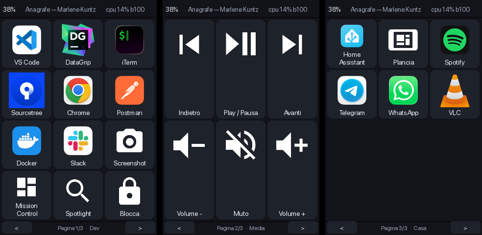

# MacDeck — Stream Deck per macOS su Guition JC3248W535

Un pannello touch da scrivania che lancia app, invia scorciatoie ed esegue script
sul MacBook, e mostra in tempo reale volume, brano in riproduzione e stato del
sistema. Quando davanti c'è Spotify, Mail, Slack, Calendar o un terminale con
Claude Code, il deck **salta da solo alla pagina di quell'app**: comandi e
dati vivi (brano, non lette, modello e contesto rimanente). I pulsanti si
configurano da una **GUI web sul Mac**: il firmware si flasha una volta e non
lo si tocca più.



## Come funziona

Il firmware ESPHome è un **renderer muto**: non conosce né app né icone né la
griglia. Scarica da `/screen/{page}.png` **una sola immagine a schermo intero**
composta dal Mac, ci sovrappone dodici rettangoli trasparenti posizionati da
`/layout`, e al tocco manda `{page, slot}` a `/press`. Tutta la conoscenza del
mondo sta in `~/.config/macdeck/layout.yaml`.

```
┌─────────────────────────┐         ┌──────────────────────────────────┐
│  JC3248W535 (ESPHome)   │  WiFi   │  Mac — agent `macdeck` (Python)  │
│  1 immagine + 12 tocchi │◄───────►│  FastAPI su :8765                │
│  + header di stato      │  HTTP   │  web UI · azioni · renderer      │
│  NESSUNA logica         │         │  layout.yaml  ← sorgente unica   │
└─────────────────────────┘         └──────────────────────────────────┘
```

**Non c'è nessun canale di push.** La risposta di `/state`, che il display
interroga ogni 2 s per volume e brano, porta anche `layout_version`: quando
cambia, il display ricarica il layout da sé. Il canale che serve comunque
trasporta gratis l'invalidazione della cache.

Conseguenze misurate: **tocco → azione in ~20-30 ms**; salvataggio nella GUI →
display aggiornato entro 2 s.

## Perché le tile sono renderizzate sul Mac

È la decisione centrale del progetto. Il Mac non manda "etichetta + nome icona",
manda l'immagine finita della tile, composta da Pillow. Questo:

- **elimina il problema dei font LVGL** documentato in `plancia-ingresso`: font
  ritagliati per taglia, il simbolo `°` assente, glifi MDI da scegliere a compile
  time;
- rende disponibili le **icone reali delle app installate** (estratte dai `.icns`
  dei bundle), tutti i **7447 glifi MDI**, qualunque PNG ed emoji a colori;
- sposta tipografia, colori e composizione in codice Python modificabile a caldo.

Costo: ~250 KB di PSRAM su 8 MB, e **una** GET HTTP quando cambia il layout.

## Hardware

| Parametro | Valore |
|---|---|
| Scheda | Guition JC3248W535 (venduta anche come "Diymore ESP32-S3 3.5\"") |
| Chip | ESP32-S3, 16 MB flash, 8 MB PSRAM ottale (`N16R8`) |
| Display | 3.5" IPS 320×480, AXS15231B su bus QSPI — usato in **landscape 480×320** |
| Touch | capacitivo integrato nell'AXS15231B, I²C `0x3B` |

**Il landscape passa da LVGL, non dal display:** l'AXS15231B non supporta lo
scambio degli assi e ESPHome rifiuta il `transform`. Si usa `lvgl: rotation: 90`,
che ruota via software e ruota anche il touch. Lo spazio utile è 480×320 e la
griglia di default è 3×3 con tile da **154×101**: senza fascia in alto e senza
barra di navigazione, lo schermo è tutto per le tile. Le pagine si cambiano
strisciando il dito. Meno righe = icone ancora più grandi.

Pinout: QSPI CLK 47, data 21/48/40/39, CS 45 · backlight GPIO1 (LEDC) · touch I²C
SDA 4, SCL 8. Supporto ESPHome **nativo** (`mipi_spi` con preset `JC3248W535` +
`axs15231`): nessun componente custom, a differenza della plancia da 7".

## Installazione

### 1. Agent sul Mac

```bash
cd agent
/usr/local/bin/python3 -m venv .venv
.venv/bin/pip install -e '.[dev]'
.venv/bin/python -m macdeck.cli fetch-fonts     # 7447 glifi MDI
.venv/bin/python -m macdeck.cli doctor          # diagnosi
.venv/bin/python -m macdeck.cli serve
```

Poi apri **http://127.0.0.1:8765** per configurare i pulsanti.

Per farlo partire al login:

```bash
.venv/bin/python -m macdeck.cli install-agent   # LaunchAgent, log in /tmp/macdeck.log
```

### 2. Il passo manuale che non si può automatizzare

Inviare tasti richiede il permesso **Accessibilità** per l'interprete del venv.
Se manca, `osascript` **non dà errore**: i tasti semplicemente non arrivano.

```bash
open 'x-apple.systempreferences:com.apple.preference.security?Privacy_Accessibility'
```

Aggiungi `agent/.venv/bin/python` all'elenco. `macdeck doctor` ti dice se è a
posto, `/state` espone `accessibility_ok`, e la web UI mostra un banner rosso.

### 3. Firmware

```bash
cd firmware
cp secrets.yaml.example secrets.yaml     # wifi + il token di `macdeck token`
esphome compile macdeck.yaml             # validazione, senza flashare
esphome run macdeck.yaml --device /dev/cu.usbmodem13301
```

Il firmware di fabbrica è salvato in `backup/app0-factory.bin` prima di
qualunque flash.

### 4. App per il Mac (facoltativa)

```bash
cd mac-app && ./build.sh && cp -R MacDeck.app /Applications/
```

Apre l'editor in una finestra propria, riavvia l'agent se serve, e aggiunge
due cose che dal browser non si possono fare: trascinare un'app dal Finder su
uno slot, e registrare una scorciatoia premendola. La GUI web resta
raggiungibile su `http://127.0.0.1:8765` esattamente come prima.

L'icona è in `mac-app/Resources/MacDeck.icns`, già pronta. Per rifarla
(serve Pillow): `agent/.venv/bin/python mac-app/icona.py`.

## Configurazione

`~/.config/macdeck/layout.yaml`:

```yaml
schema: 1
grid: {cols: 3, rows: 3}
theme:
  background: "#12141A"
  tile: "#1E222B"
  text: "#E8EAF0"
  accent: "#4A9EFF"
  font: SFNS
  icon_scale: 1.0        # moltiplicatore della dimensione dell'icona
pages:
  - name: Media
    when: media.app          # la pagina compare solo se c'è un player attivo
    grid: {cols: 3, rows: 2}
    slots: []

  - name: Dev
    slots:
      - pos: [0, 0]                       # colonna, riga
        label: DataGrip
        icon: "app:/Applications/DataGrip.app"
        action: {type: app, target: DataGrip}
      - pos: [1, 0]
        label: "Commit\n& push"
        icon: "mdi:source-branch"
        color: "#2A5CAA"
        action:
          type: sequence
          steps:
            - {type: keys, keys: "cmd+s"}
            - {type: delay, ms: 200}
            - {type: shell, cmd: "cd ~/src/foo && git add -A && git commit -m wip"}
      - pos: [2, 2]
        label: Muto
        icon: "mdi:volume-off"
        action: {type: volume, op: mute_toggle}
        state: volume.muted                # bordo di accento quando è vero
```

Le posizioni sono **sparse**: i buchi nella griglia sono naturali e riordinare non
richiede di riscrivere indici.

### Pagine per app

Una pagina con `app:` compare, e il deck ci salta, quando quell'app è in primo
piano. Con lo swipe si torna alla griglia; al prossimo cambio di app si risalta.

```yaml
  - name: Spotify
    app: com.spotify.client          # nome, bundle id o percorso; anche una lista
    grid: {cols: 3, rows: 2}
    slots:
      - pos: [0, 0]
        kind: info                     # tile informativa: valore grande, didascalia
        label: "{media.title}"         # i segnaposto leggono /state
        caption: "{media.artist}"
        span: 3                        # occupa tre colonne
      - pos: [1, 1]
        label: Play / Pausa
        icon: "mdi:play-pause"
        action: {type: media, op: play_pause}
```

Le chiavi disponibili per i segnaposto (`{mail.unread}`, `{claude.model}`,
`{claude.remaining|int}`, `{claude.session_used|int}` (utilizzo della finestra di cinque ore), `{calendar.next}`, `{slack.badge}`…) le elenca la GUI
nel menu «Inserisci valore». `app:` e `when:` si combinano: la pagina Claude Code
ha `app: [com.googlecode.iterm2, com.apple.Terminal]` e `when: claude.alive`.

Nomi che non coincidono e che conviene sapere: iTerm è `iTerm2` come processo,
`iTerm` come nome visibile, `com.googlecode.iterm2` come bundle. Il Terminale è
`Terminal` / `com.apple.Terminal`. Calendar è `com.apple.iCal`. Slack è
`com.tinyspeck.slackmacgap`.

Le chiavi che cambiano ogni pochi secondi (per esempio `{system.cpu}` o
`{system.ram}`) è meglio non metterle in una tile: ogni cambio di valore
ridisegna l'intera pagina sul display, e a quella cadenza si vede. Usale solo
se il ridisegno a ogni poll non ti disturba.

### Il ponte con Claude Code

Modello, contesto rimanente e cartella li conosce solo Claude Code, che li passa
alla tua `statusLine`. Aggiungi in testa al comando in `~/.claude/settings.json`:

```sh
input=$(cat); mkdir -p ~/.config/macdeck/claude; printf '%s' "$input" > ~/.config/macdeck/claude/$(echo "$input" | jq -r .session_id).json; # ...poi il resto
```

`macdeck doctor` dice se i file arrivano. Con più sessioni aperte il deck mostra
l'ultima con cui hai parlato.

### Tipi di azione

| Tipo | Campi | Note |
|---|---|---|
| `app` | `target` | nome, percorso o bundle id |
| `keys` | `keys`, `to` | `cmd+shift+4`, `ctrl+up`, `cmd+return`… |
| `text` | `text` | digita una stringa |
| `url` | `url` | apre nel browser di default |
| `shell` | `cmd`, `cwd` | asincrona |
| `applescript` | `script` | asincrona |
| `shortcut` | `name` | Shortcut di macOS, asincrona |
| `volume` | `op` (`set`/`up`/`down`/`mute_toggle`), `value`, `step` | |
| `media` | `op` (`play_pause`/`next`/`prev`) | solo Spotify e Music, vedi limiti |
| `page` | — | gestito dal firmware in locale |
| `sequence` | `steps` | componibile, anche annidata |
| `delay` | `ms` | passo dentro una sequence |
| `noop` | — | segnaposto |

Aggiungere un tipo costa **una funzione decorata** in `agent/macdeck/actions.py`:
la validazione del layout e la GUI leggono lo stesso registry.

### Schemi delle icone

`app:` (percorso, nome o bundle id) · `mdi:` (7447 glifi) · `file:` (qualunque
immagine) · `emoji:` (a colori) · `text:` (fino a 3 caratteri).

## Limiti dichiarati

- **Il brano in riproduzione si legge solo da Spotify e Music.** Su macOS recente
  MediaRemote è chiuso, quindi non esiste un "now playing" di sistema leggibile
  senza helper esterni. L'audio da browser non è visibile: è un limite, non un bug.
- **Il deck è muto fuori dalla LAN del Mac.** È un accessorio da scrivania; il
  display mostra "Mac non raggiungibile" invece di fallire in silenzio.
- **Ogni keystroke costa ~60-100 ms** perché passa da `osascript`. Se diventasse
  un problema, il piano B è `cliclick`: una funzione da riscrivere, non un rewrite.
- **12 slot per pagina al massimo**, che è il numero di widget immagine nel firmware. Le
  pagine sono illimitate.
- **Il cambio pagina segue il polling:** da 1 a 4 s fra il cambio app e il display. Non
  c'è push, per scelta.
- **Il badge di Slack** si legge dal Dock via Accessibilità: se non c'è o non è
  leggibile, la tile mostra la sola didascalia.
- **Un tocco arriva sempre alla pagina che vedi.** Fra un cambio di app e il poll
  successivo il display mostra ancora la pagina di prima: il Mac esegue l'azione
  di quella, non della nuova, perché `/press` e `/screen` agiscono sul mazzo
  servito all'ultimo `/layout`.

## Test

```bash
cd agent && .venv/bin/python -m pytest        # 412 test (1 skipped), nessun hardware richiesto
```

Il 90% del sistema è testabile senza il display: `executor.py` è l'unico modulo
che tocca `subprocess`, e i test lo sostituiscono con un fake che registra le
chiamate invece di eseguirle.

## Documenti

- [Design](docs/specs/2026-08-27-macdeck-design.md) — architettura,
  protocollo, decisioni e alternative scartate
- [Piano di implementazione](docs/plans/2026-08-27-macdeck.md) — 14 task
- [Design delle pagine per app](docs/specs/2026-09-04-pagine-per-app-design.md)
- [Piano delle pagine per app](docs/plans/2026-09-04-pagine-per-app.md)
- [NOTE-TECNICHE.md](NOTE-TECNICHE.md) — note tecniche e trappole incontrate

## Portare il deck fuori casa

Il cavo USB serve solo alla corrente: il deck parla col Mac via WiFi. Basta
che i due siano sulla stessa rete — qualunque rete.

**Non c'è un indirizzo da configurare.** Il deck si annuncia via Bonjour,
l'agent sul Mac lo cerca ogni trenta secondi e gli scrive dove trovarsi; il
deck se lo ricorda anche da spento. Se il router riassegna gli indirizzi a
entrambi, si ritrovano al giro dopo.

Le reti che il deck conosce stanno in `firmware/secrets.yaml`:

| | |
|---|---|
| `wifi_ssid` · `wifi_password` | casa |
| `wifi_ssid_ufficio` · `wifi_password_ufficio` | ufficio |

**Due reti, e due sole.** Le prova entrambe e si attacca a quella che vede;
se non ne vede nessuna continua a riprovare senza arrendersi mai, e dopo
dieci minuti si riavvia per rimettere in moto una radio impuntata. Non alza
nessun access point e non ha nessun portale: vedi *Perché niente portale*
più sotto, è una decisione, non una mancanza.

Col Mac spento il deck resta acceso e rallenta i tentativi a uno ogni
quattordici secondi; quando il Mac torna, riparte da solo.

### Perché niente portale

Una rete insegnata a caldo **non si aggiunge** a quelle compilate: le
sostituisce. All'avvio ESPHome fa `if (pref_.load(&save)) { set_sta(sta); }`,
e `set_sta` comincia con `clear_sta()` — una sola voce salvata in flash
cancella casa e ufficio, per sempre, anche mentre funzionavano. È accaduto:
un deck con la password di casa giusta compilata dentro è rimasto fuori
dalla rete di casa per un giorno, mostrando "Mac non raggiungibile" mentre
inseguiva una rete che non esisteva più.

Per questo l'access point di ripiego e il portale non ci sono più: erano i
canali che scrivevano quella voce. Le due reti stanno nel firmware, dove
nulla può cancellarle.

### Una rete nuova, sul momento

Resta una via, e passa dal cavo dati:

```bash
macdeck pair --usb
```

Serve un cavo **dati** (molti cavi da ricarica non hanno i fili per i dati),
e serve solo per quel passaggio: subito dopo il deck torna in WiFi con la
sola alimentazione. Da usare sapendo cosa comporta: la rete passata così
finisce nella voce in flash e **sostituisce casa e ufficio** finché non si
riflasha. Per una rete che ti serve stabilmente, il posto giusto è
`secrets.yaml` più un `esphome run`.

**Riflashare il firmware cancella le reti imparate cosi'.** Le credenziali che
arrivano da `pair` finiscono in una zona di preferenze indicizzata dall'hash
della configurazione: ricompilando, l'hash cambia e quelle vecchie diventano
irraggiungibili. Il deck riparte conoscendo solo le reti di `secrets.yaml`, e
se nessuna e' a portata resta muto senza dire perche'. Dopo ogni `esphome run`
fuori casa, ripassagli la rete con `macdeck pair`: sono sette secondi.

**Un caso in cui non funziona niente:** su molte reti pubbliche — alberghi,
aeroporti — il router impedisce ai dispositivi collegati di parlarsi fra
loro. Mac e deck finiscono sulla stessa rete e restano invisibili l'uno
all'altro. Lì l'unica via è l'hotspot del telefono, con entrambi attaccati a
quello.

`macdeck doctor` dice se il deck è stato trovato, quale indirizzo gli è stato
annunciato, e se il firewall di macOS è attivo — che fuori casa è la causa
più frequente di un deck che sembra irraggiungibile.
